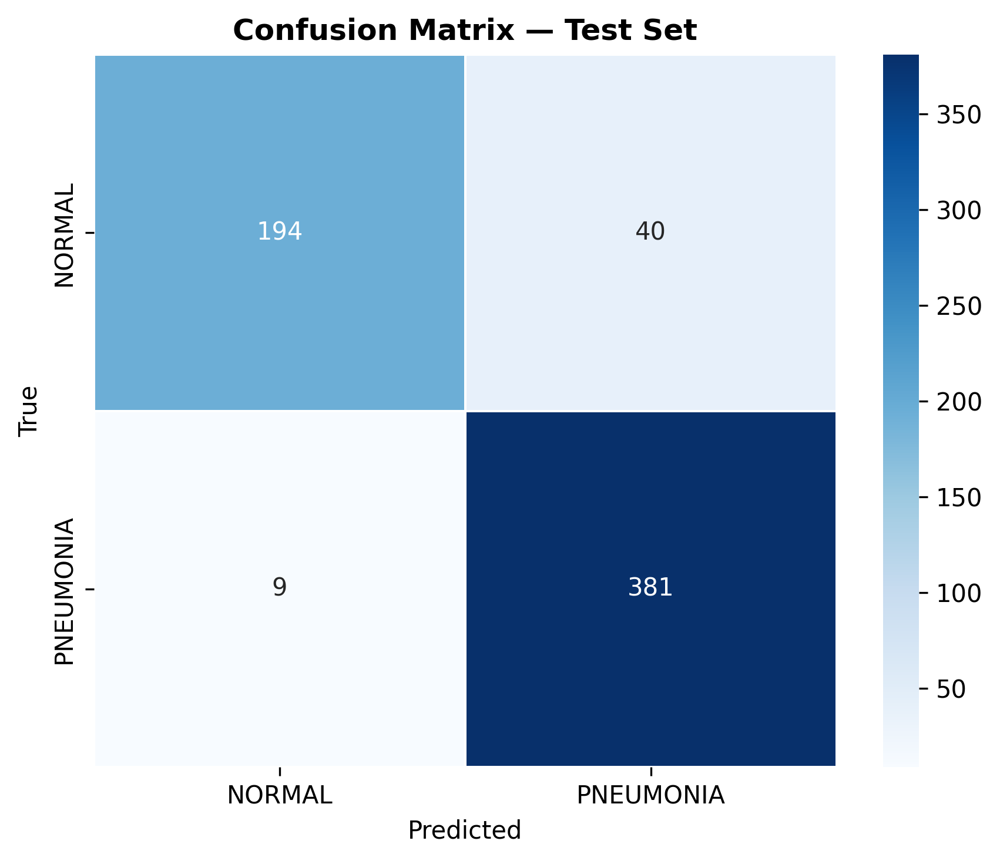
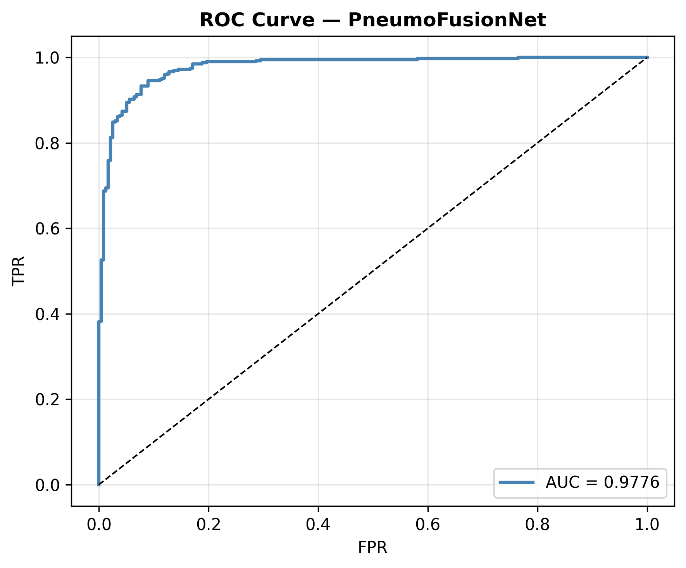

# PneumoFusionNet-V2
### Explainable Deep Learning Framework for Pneumonia Detection from Chest X-ray Images

<p align="center">
  
</p>

---

## Overview

PneumoFusionNet-V2 is an explainable deep learning framework designed for automated pneumonia detection from chest X-ray images.

The project leverages transfer learning, medical image preprocessing, Grad-CAM explainability, and deep feature extraction techniques to classify chest X-rays into:

- NORMAL
- PNEUMONIA

The primary objective of this project is not only high classification performance but also visual interpretability for medical imaging applications.

---

## Key Features

- Transfer Learning based CNN Architecture
- Explainable AI using Grad-CAM
- Binary Chest X-ray Classification
- ROC-AUC Evaluation
- Early Stopping and Model Checkpointing
- Confusion Matrix Visualization
- Medical Image Augmentation Pipeline
- High Recall for Pneumonia Detection

---

## Dataset

Dataset Used:
### Chest X-ray Pneumonia Dataset

Dataset link available in:

```text
dataset/dataset_link.txt
```

---

## Model Architecture

The framework consists of the following stages:

1. Chest X-ray Input
2. Image Preprocessing & Augmentation
3. Transfer Learning Backbone
4. Deep Feature Extraction
5. Global Average Pooling
6. Fully Connected Classification Head
7. Grad-CAM Explainability Module

---

## Repository Structure

```text
PneumoFusionNet/
│
├── notebooks/
│   └── pneumofusionnet_final.ipynb
│
├── models/
│   ├── best_model_acc.pth
│   └── best_model_loss.pth
│
├── results/
│   ├── confusion_matrix.png
│   ├── roc_curve.png
│   └── classification_report.txt
│
├── images/
│   ├── architecture.png
│   └── gradcam.png
│
├── dataset/
│   └── dataset_link.txt
│
├── archive/
│   └── v1_baseline_model.ipynb
│
├── README.md
└── .gitignore
```

---

## Experimental Results

| Metric | Score |
|--------|--------|
| Accuracy | 92.15% |
| ROC-AUC | 0.9776 |
| Precision | 0.92 |
| Recall | 0.92 |
| F1-Score | 0.92 |

---

## Classification Report

| Class | Precision | Recall | F1-Score |
|------|------|------|------|
| NORMAL | 0.96 | 0.83 | 0.89 |
| PNEUMONIA | 0.90 | 0.98 | 0.94 |

---

## Confusion Matrix

<p align="center">
  
</p>

### Confusion Matrix Analysis

- True Normal Predicted Normal: 194
- True Normal Predicted Pneumonia: 40
- True Pneumonia Predicted Normal: 9
- True Pneumonia Predicted Pneumonia: 381

The model demonstrates very high recall for pneumonia detection, minimizing false negatives in medical diagnosis.

---

## ROC Curve

<p align="center">
  
</p>

The ROC-AUC score of **0.9776** indicates excellent discriminative performance for pneumonia classification.

---

## Explainability using Grad-CAM

Grad-CAM visualization is used to highlight the lung regions responsible for model predictions, improving interpretability and trustworthiness in medical imaging applications.

<p align="center">
  
</p>

---

## Technologies Used

- Python
- PyTorch
- OpenCV
- NumPy
- Matplotlib
- Scikit-learn
- Grad-CAM
- Transfer Learning

---

## Future Work

- Integration with MIMIC-CXR dataset
- Clinical report generation
- Multimodal medical AI pipeline
- Transformer-based architectures
- External dataset validation
- Advanced explainable AI methods

---

## Installation

```bash
git clone https://github.com/your-username/PneumoFusionNet.git

cd PneumoFusionNet

pip install -r requirements.txt
```

---

## Usage

Run the final notebook:

```bash
notebooks/pneumofusionnet_final.ipynb
```

---

## Author

### Ashutosh Yadav
- IIT Guwahati
- Data Science & AI

---

## License

This project is intended for educational and research purposes only.
