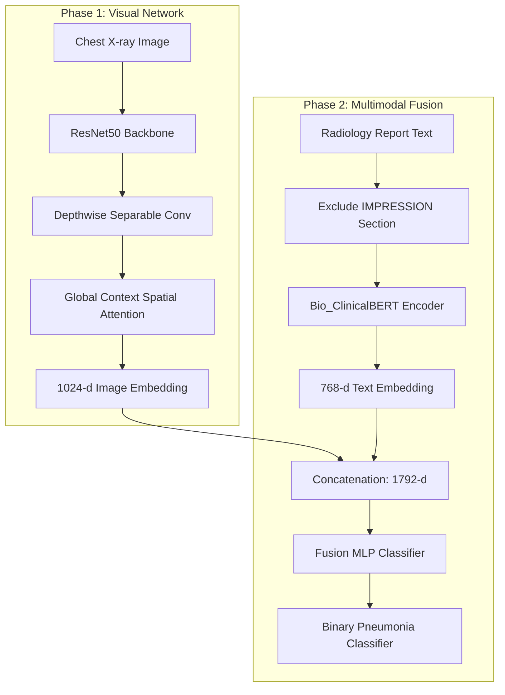

# 🫁 PneumoFusionNet on MIMIC-CXR

[](https://www.python.org/)
[](https://pytorch.org/)
[](https://huggingface.co/docs/transformers/index)
[](https://physionet.org/content/mimic-cxr-jpg/2.0.0/)
[](https://opensource.org/licenses/MIT)

> **Explainable Multimodal Deep Learning Framework for Pneumonia Detection from MIMIC-CXR Chest X-rays and Clinical Reports**  
> Adapting the **PneumoFusionNet** architecture (originally proposed in *Frontiers in Physiology, 2025*) to the MIMIC-CXR medical imaging dataset.

---

## 📋 Project Overview

PneumoFusionNet is a state-of-the-art multimodal deep learning framework designed to diagnose binary pneumonia by fusing information from multiple clinical modalities. This repository implements a pipeline using the **MIMIC-CXR JPG** dataset (P10 subset) across multiple research phases:

```
Phase 1: Image Only ──► Phase 2: Multimodal (Image + Text) ──► Phase 3: Multimodal + Lab Data (Upcoming)
```

1. **Phase 1 (Chest X-ray Image Classifier)**: Extracting visual embeddings using a custom CNN backbone enhanced with spatial attention.
2. **Phase 2 (Multimodal Fusion)**: Fusing visual embeddings with ClinicalBERT representations parsed from raw radiology text reports.
3. **Phase 3 (Lab Data Integration)**: Extending the fusion network to incorporate tabular laboratory measurements (WBC, CRP, etc.) from MIMIC-IV.

---

## 🏗️ Architecture & Pipeline



### Key Components

*   **ResNet50 Backbone**: Deep feature extractor pre-trained on ImageNet.
*   **Depthwise Separable Convolution (DSC)**: Dramatically reduces feature dimensions from 2048 to 1024 with minimal parameter overhead.
*   **Global Context Spatial Attention (GCSA)**: Focuses the feature extractor on key pathological areas of the chest X-rays.
*   **Bio_ClinicalBERT**: A BERT transformer model pre-trained on clinical notes from MIMIC-III, capturing medical text semantics.

---

## 🔒 Anti-Leakage & Anti-Cheating Design

Radiology report summaries (specifically the `IMPRESSION` or `CONCLUSION` sections) routinely contain the final diagnoses. Training a model on these sections causes **label leakage** (the model reads the doctor's final diagnosis instead of diagnosing from the medical findings).

To prevent this, our pipeline implements a **strict text-filtering strategy**:
*   The raw report is parsed, and the `IMPRESSION` section is **completely removed** on-the-fly.
*   The model must rely entirely on the image coupled with the clinical history, comparison statements, and findings sections of the report to make its classification.

---

## 📊 Experimental Results

Both phases were trained using the exact same stratified 70/15/15 train/validation/test split (`SEED=42`) for a fair and leakage-free comparison.

| Model | Test AUC | Test Accuracy | Test F1 (macro) |
| :--- | :---: | :---: | :---: |
| **Phase 1 (Image Only)** | 0.6667 | 0.7619 | 0.4300 |
| **Phase 2 (Image + Report)** | **0.7037** | **0.8095** | **0.4474** |
| **Multimodal Improvement** | **+0.0370** | **+0.0476** | **+0.0174** |

*Integrating clinical text reports (even without the diagnostic impression) provides a significant diagnostic boost over chest X-rays alone.*

---

## 📁 Repository Structure

```text
PneumoFusionNet/
│
├── mimic/
│   ├── mimic_pilot_139/
│   │   ├── dataset_139/
│   │   │   ├── mimic_dataset.csv               # Image-only baseline dataset (139 samples)
│   │   │   └── mimic_multimodal_dataset_v3.csv  # Multimodal dataset metadata (no impression)
│   │   │
│   │   ├── reports/txt/                         # Raw text radiology reports (.txt)
│   │   │
│   │   ├── Notebooks/
│   │   │   ├── Phase-1.1mimic_image_classifier(balanced-Set).ipynb  # Phase 1 notebook
│   │   │   └── Phase-2_multimodal_fusion.ipynb                      # Phase 2 notebook
│   │   │
│   │   └── outputs/                              # Evaluation outputs & metrics
│   │       ├── phase_1/
│   │       │   ├── confusion_matrix.png          # Phase 1 test confusion matrix
│   │       │   ├── roc_curve.png                 # Phase 1 ROC curve (AUC=0.6667)
│   │       │   └── training_history.png          # Loss/accuracy curves
│   │       │
│   │       ├── Phase_1.1(balanced set)/
│   │       │   └── confusion_matrix.png
│   │       │
│   │       └── phase_2/
│   │           ├── phase1_vs_phase2_comparison.png  # Visualizing AUC improvement
│   │           ├── phase2_results.png               # Multimodal metrics
│   │           └── phase2_training_history.png      # Multimodal training history
│   │
│   ├── .gitignore
│   ├── README.md
│   └── requirements.txt
│
├── model_experiments/                            # General model & various dataset experiments
│   ├── v1_Basic_Image_Model.ipynb
│   ├── v2_Enhanced_Image_Model_GCSA_DSC.ipynb
│   ├── v3-1-iu-dataset-multimodal-image-baseline.ipynb
│   └── v3-2-iu-dataset-multimodal-image-text.ipynb
│
├── experiment_results/                           # Stored evaluation metrics and plots
│   └── V2_results/
│       ├── best_model_acc.pth
│       ├── confusion_matrix.png
│       └── roc_curve.png
│
├── README.md                                     # Main repository README (this file)
└── .gitignore
```

---

## ⚙️ Setup & Installation

### Prerequisites
*   Python 3.10+
*   NVIDIA GPU with CUDA support (e.g., NVIDIA RTX 3050 Laptop GPU, CUDA 11.2+)

### 1. Clone & Initialize Environment
```bash
git clone https://github.com/Ashutosh-yadav0001/PneumoFusionNet.git
cd PneumoFusionNet

# Create a python virtual environment
python -m venv mimic/venv_PneumoFusionNet
source mimic/venv_PneumoFusionNet/bin/activate  # On Linux/macOS
# OR
mimic\venv_PneumoFusionNet\Scripts\activate     # On Windows
```

### 2. Install PyTorch & Core Libraries
Install PyTorch with CUDA support. For CUDA 11.2+:
```bash
pip install torch==1.12.1+cu113 torchvision==0.13.1+cu113 --extra-index-url https://download.pytorch.org/whl/cu113
```

Install remaining dependencies:
```bash
pip install -r mimic/requirements.txt
```

### 3. Launch Notebooks
```bash
# Register the environment kernel with Jupyter
python -m ipykernel install --user --name=venv_PneumoFusionNet --display-name "PneumoFusionNet"

# Launch Jupyter
jupyter lab
```

---

## 🔑 Data Access Warning

MIMIC-CXR and MIMIC-IV are restricted-access datasets. To download the clinical notes and image paths used here:
1. Complete the CITI training course on human subjects research.
2. Sign the PhysioNet Data Use Agreement (DUA).
3. Request access via the [PhysioNet MIMIC-CXR Page](https://physionet.org/content/mimic-cxr-jpg/2.0.0/).

---

## 👨‍💻 Author

**Ashutosh Yadav**  
*   **Affiliation**: Indian Institute of Technology Guwahati (IIT Guwahati)  
*   **Specialization**: B.Sc. in Data Science & Artificial Intelligence  
*   **Email**: [ay346185@gmail.com](mailto:ay346185@gmail.com)  
*   **GitHub**: [@Ashutosh-yadav0001](https://github.com/Ashutosh-yadav0001)  
