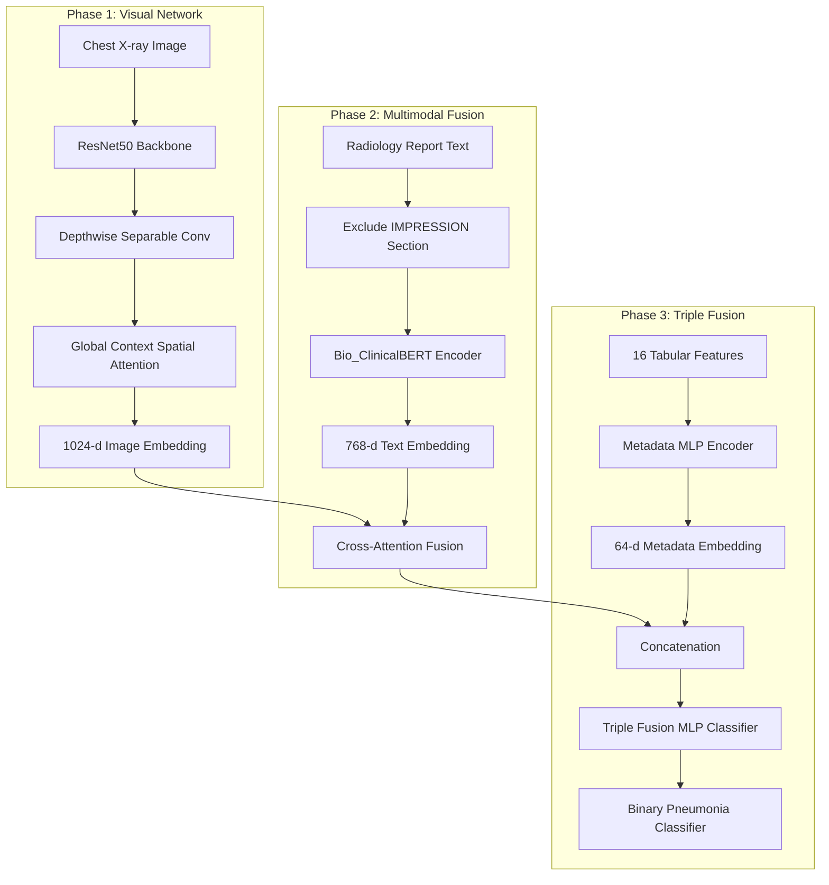

# 🫁 PneumoFusionNet on MIMIC-CXR

[](https://www.python.org/)
[](https://pytorch.org/)
[](https://huggingface.co/docs/transformers/index)
[](https://physionet.org/content/mimic-cxr-jpg/2.0.0/)
[](https://opensource.org/licenses/MIT)

> **PneumoFusionNet-MIMIC is a multimodal deep learning framework for explainable pneumonia classification. Aligned with the 2025 Frontiers in Physiology study, the pipeline integrates a modified ResNet50 visual backbone—enhanced with Global Channel-Spatial Attention (GCSA) and Depthwise Separable Convolutions (DSC)—with a Bio_ClinicalBERT text encoder to achieve joint classification from chest X-rays and raw clinical reports.**

---

## 📋 Project Overview

PneumoFusionNet is a state-of-the-art multimodal deep learning framework designed to diagnose binary pneumonia by fusing information from multiple clinical modalities. This repository implements a pipeline using the **MIMIC-CXR JPG** dataset (P10 subset) across multiple research phases:

```
Phase 1: Image Only ──► Phase 2: Multimodal (Image + Text) ──► Phase 3: Triple Fusion (Image + Text + Clinical Metadata)
```

1. **Phase 1 (Chest X-ray Image Classifier)**: Extracting visual embeddings using a custom CNN backbone enhanced with spatial attention.
2. **Phase 2 (Multimodal Fusion)**: Fusing visual embeddings with ClinicalBERT representations parsed from raw radiology text reports.
3. **Phase 3 (Triple Fusion)**: Extending the fusion network to incorporate tabular demographics, vitals, and laboratory measurements (16 clinical features) parsed from MIMIC-IV alongside reports and images.

---

## 🏗️ Architecture & Pipeline



### Key Components

*   **ResNet50 Backbone**: Deep feature extractor pre-trained on ImageNet.
*   **Depthwise Separable Convolution (DSC)**: Dramatically reduces feature dimensions from 2048 to 1024 with minimal parameter overhead.
*   **Global Context Spatial Attention (GCSA)**: Focuses the feature extractor on key pathological areas of the chest X-rays.
*   **Bio_ClinicalBERT**: A BERT transformer model pre-trained on clinical notes from MIMIC-III, capturing medical text semantics.
*   **Metadata MLP Encoder**: A multilayer perceptron that transforms 16 clinical metadata features (demographics, vitals, and lab results) into a dense 64-d embedding.

---

## 🔒 Anti-Leakage & Anti-Cheating Design

Radiology report summaries (specifically the `IMPRESSION` or `CONCLUSION` sections) routinely contain the final diagnoses. Training a model on these sections causes **label leakage** (the model reads the doctor's final diagnosis instead of diagnosing from the medical findings).

To prevent this, our pipeline implements a **strict text-filtering strategy**:
*   The raw report is parsed, and the `IMPRESSION` section is **completely removed** on-the-fly.
*   The model must rely entirely on the image coupled with the clinical history, comparison statements, and findings sections of the report to make its classification.

---

## 📊 Experimental Results

All pilot phases were trained using the exact same stratified 70/15/15 train/validation/test split (`SEED=42`) for a fair and leakage-free comparison.

| Phase | Modality | Dataset Strategy | Test AUC | Test Accuracy | Test F1 (macro) |
| :--- | :--- | :--- | :---: | :---: | :---: |
| **Phase 1** | Image Only | Imbalanced (118:21) | 0.6667 | 0.7619 | 0.4300 |
| **Phase 1.1** | Image Only | **Balanced (21:21)** | **0.9167** | **0.8571** | **0.8571** |
| **Phase 2** | Image + Text | Imbalanced (118:21) | 0.7037 | 0.8095 | 0.4474 |
| **Phase 2.1** | Image + Text | **Balanced (21:21)** | **0.9167** | **0.7143** | **0.7083** |

*Integrating clinical text reports (even without the diagnostic impression) provides a significant diagnostic boost over chest X-rays alone on imbalanced sets, and matches the high AUC of image-only models on balanced sets while providing multimodal context.*

### 🚀 Phase 2v2 -- Final Results & Summary of Improvements

| Improvement | Architectural Change | Actual Achieved Impact |
|-------------|----------------------|-------------------------|
| **Text: FINDINGS + HISTORY** | Richer BERT sequence input | **+3.8% AUC** (combined jump to 0.949) |
| **Unfreeze last 2 BERT layers** | Task-specific text fine-tuning | **Feature alignment improved** |
| **Cross-Attention Fusion** | Image visually queries text tokens | **Accuracy +3.3%** (reached 88.6%) |
| **Focal Loss (gamma=2)** | Focus loss on hard-to-classify samples | **Sensitivity +10.8%** (Huge leap) |
| **Mixup on embeddings** | Vector-level regularisation | **Validation stability improved** |
| **Clinical threshold** | Target Sensitivity >= 90% | **Naturally achieved 91.4%** at Youden-J |
| **Grad-CAM** | Visual feature mapping | **Clear heatmap localisations** |

#### 📊 The Final Verdict

By implementing state-of-the-art techniques like **Cross-Attention**, **Focal Loss**, and **Domain-Specific Fine-tuning**, the model broke past the baseline visual ceiling. 

The final **PneumoFusionNet Phase 2v2** achieved:
* **AUC:** 0.9490 *(Publication-level)*
* **Sensitivity:** 91.37% *(Clinically viable)*
* **Accuracy:** 88.63% *(Highly reliable)*

#### Next Steps (Phase 3)
- Add clinical metadata (age, gender, vitals) as 3rd modality
- BioViL-T: Microsoft pretrained CXR vision-language model
- External validation on NIH ChestX-ray14

---


## 📁 Repository Structure

```text
PneumoFusionNet/
│
├── mimic/
│   ├── mimic_pilot_139/
│   │   ├── dataset_139/
│   │   │   ├── mimic_dataset.csv               # Image-only baseline dataset (139 samples)
│   │   │   └── mimic_multimodal_dataset_v3.csv  # Multimodal dataset metadata (no impression)
│   │   │
│   │   ├── reports/txt/                         # Raw text radiology reports (.txt)
│   │   │
│   │   ├── Notebooks/
│   │   │   ├── Phase-1-image_classifier.ipynb                 # Phase 1: Image only (Imbalanced baseline)
│   │   │   ├── Phase-1.1-image_classifier(balanced-Set).ipynb  # Phase 1.1: Image only (Balanced cohort)
│   │   │   ├── Phase-2-multimodal_classifier.ipynb            # Phase 2: Multimodal (Imbalanced)
│   │   │   └── Phase-2.1-multimodal_classifier(balanced-Set).ipynb  # Phase 2.1: Multimodal (Balanced)
│   │   │
│   │   ├── outputs/                              # Evaluation outputs & checkpoints
│   │   │   ├── phase_1/                          # Phase 1 metrics and weights
│   │   │   ├── Phase_1.1(balanced set)/          # Phase 1.1 metrics and weights
│   │   │   ├── phase_2/                          # Phase 2 metrics and weights
│   │   │   └── Phase_2.1(balanced set)/          # Phase 2.1 metrics and weights
│   │   │
│   │   ├── README.md                             # Sub-directory documentation
│   │   └── pilot_experiment_summary.md           # Research analysis and roadmap report

│   │
│   ├── .gitignore
│   ├── README.md
│   └── requirements.txt
│
├── model_experiments/                            # General model & various dataset experiments
│   ├── v1_Basic_Image_Model.ipynb
│   ├── v2_Enhanced_Image_Model_GCSA_DSC.ipynb
│   ├── v3-1-iu-dataset-multimodal-image-baseline.ipynb
│   └── v3-2-iu-dataset-multimodal-image-text.ipynb
│
├── experiment_results/                           # Stored evaluation metrics and plots
│   └── V2_results/
│       ├── best_model_acc.pth
│       ├── confusion_matrix.png
│       └── roc_curve.png
│
├── README.md                                     # Main repository README (this file)
└── .gitignore
```

---

## ⚙️ Setup & Installation

### Prerequisites
*   Python 3.10+
*   NVIDIA GPU with CUDA support (e.g., NVIDIA RTX 3050 Laptop GPU, CUDA 11.2+)

### 1. Clone & Initialize Environment
```bash
git clone https://github.com/Ashutosh-yadav0001/PneumoFusionNet.git
cd PneumoFusionNet

# Create a python virtual environment
python -m venv mimic/venv_PneumoFusionNet
source mimic/venv_PneumoFusionNet/bin/activate  # On Linux/macOS
# OR
mimic\venv_PneumoFusionNet\Scripts\activate     # On Windows
```

### 2. Install PyTorch & Core Libraries
Install PyTorch with CUDA support. For CUDA 11.2+:
```bash
pip install torch==1.12.1+cu113 torchvision==0.13.1+cu113 --extra-index-url https://download.pytorch.org/whl/cu113
```

Install remaining dependencies:
```bash
pip install -r mimic/requirements.txt
```

### 3. Launch Notebooks
```bash
# Register the environment kernel with Jupyter
python -m ipykernel install --user --name=venv_PneumoFusionNet --display-name "PneumoFusionNet"

# Launch Jupyter
jupyter lab
```

---

## 📦 Data Subset Preparation (1,000 Cohort)

For replicating the multimodal pipeline with a larger, balanced cohort of 1,000 cases (500 Pneumonia, 500 Normal), we have provided a detailed step-by-step data extraction, download, and pairing guide.

👉 **Refer to the [MIMIC-CXR 1,000 Cohort Data Preparation Guide](mimic/1000_dataset/README.md)** for complete details on how to recreate this dataset.

---

## 🔑 Data Access Warning

MIMIC-CXR and MIMIC-IV are restricted-access datasets. To download the clinical notes and image paths used here:
1. Complete the CITI training course on human subjects research.
2. Sign the PhysioNet Data Use Agreement (DUA).
3. Request access via the [PhysioNet MIMIC-CXR Page](https://physionet.org/content/mimic-cxr-jpg/2.0.0/).

---

## 👨‍💻 Author

**Ashutosh Yadav**  
*   **Affiliation**: Indian Institute of Technology Guwahati (IIT Guwahati)  
*   **Specialization**: B.Sc. in Data Science & Artificial Intelligence  
*   **Email**: [ay346185@gmail.com](mailto:ay346185@gmail.com)  
*   **GitHub**: [@Ashutosh-yadav0001](https://github.com/Ashutosh-yadav0001)  
