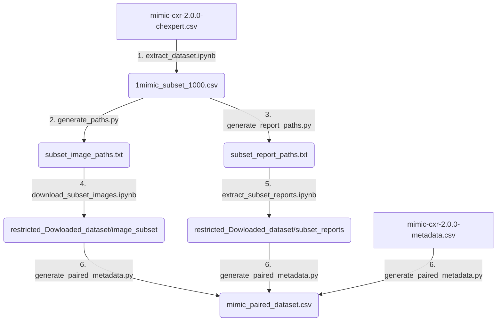

# MIMIC-CXR 1,000 Patient Subset Preparation Guide

This guide describes the complete step-by-step pipeline to extract, download, and pair a multimodal subset of the **MIMIC-CXR** dataset consisting of:
- **500 Pneumonia** cases (`Pneumonia == 1.0`)
- **500 Normal/No Finding** cases (`No Finding == 1.0`)
- Corresponding **radiology reports** (.txt)
- Corresponding **metadata** (such as projection `ViewPosition` e.g., AP, PA, Lateral)

---

## Pipeline Overview

---

## Step-by-Step Implementation

### Step 1: Filter and Extract the Cohort
We load the master CheXpert label mapping CSV to select our balanced cohort.
*   **Notebook**: `extract_dataset.ipynb`
*   **Input**: `mimic-cxr-2.0.0-chexpert.csv` (from MIMIC-CXR dataset downloads)
*   **Action**: Selects 500 cases with `Pneumonia == 1.0` and 500 random cases with `No Finding == 1.0`.
*   **Output**: `1mimic_subset_1000.csv` containing columns `subject_id`, `study_id`, `Pneumonia`, and `No Finding`.

### Step 2: Generate Image Path Lists
MIMIC-CXR contains multiple images per study. We scan the database file manifest to find all images associated with the study IDs in our cohort.
*   **Script**: `generate_paths.py`
*   **Input**: `1mimic_subset_1000.csv` and `IMAGE_FILENAMES` (a text file listing all raw image paths in the MIMIC-CXR repository).
*   **Action**: Extracts path names starting with `files/pXX/pXXXXXXXX/sXXXXXXXX/` that match our cohort study IDs.
*   **Output**: `subset_image_paths.txt` (typically yields ~1,700 image paths, as studies often have multiple views like PA/LATERAL).

### Step 3: Generate Report Path Lists
We locate the corresponding radiology reports in the dataset structure.
*   **Script**: `generate_report_paths.py`
*   **Input**: `1mimic_subset_1000.csv`
*   **Action**: Generates the exact directory paths where the text reports are located:
    `files/p{prefix}/p{subject_id}/s{study_id}.txt`
*   **Output**: `subset_report_paths.txt`

### Step 4: Download/Extract the Dataset Subset
Using the generated text manifests, download or extract the files from your storage/MIMIC source:
*   **Images**: Run `download_subset_images.ipynb` to download/copy images from the manifest list into:
    `restricted_Dowloaded_dataset/image_subset/` (saved as flat `[dicom_id].jpg` files).
*   **Reports**: Run `extract_subset_reports.ipynb` to download/copy report files into:
    `restricted_Dowloaded_dataset/subset_reports/pXX/pXXXXXXXX/sXXXXXXXX.txt` (saved nested under patient folders).

### Step 5: Multimodal Pairing & Metadata Extraction
Finally, we pair each downloaded image with its metadata and report file.
*   **Script**: `generate_paired_metadata.py`
*   **Inputs**:
    *   `restricted_Dowloaded_dataset/image_subset/` (Local image folder)
    *   `restricted_Dowloaded_dataset/subset_reports/` (Local report folder)
    *   `restricted_Dowloaded_dataset/mimic-cxr-2.0.0-metadata.csv` (MIMIC-CXR metadata file)
    *   `1mimic_subset_1000_images.csv` (CheXpert labels)
*   **Action**:
    1. Iterates over all downloaded local `.jpg` images.
    2. Uses the image filename (`dicom_id`) to look up patient details (`subject_id`, `study_id`) and projection view (`ViewPosition`) in `mimic-cxr-2.0.0-metadata.csv`.
    3. Finds the local text report path corresponding to the patient/study.
    4. Propagates the CheXpert labels (`Pneumonia`, `No Finding`).
*   **Output**: `mimic_paired_dataset.csv` (saved locally, **do not commit to Git**).

---

## Output CSV Format (`mimic_paired_dataset.csv`)

The output CSV file contains the following columns for model training/evaluation:

| Column | Type | Description |
| :--- | :--- | :--- |
| `patient_id` | String | Patient ID with prefix format (e.g., `p13244322`) |
| `subject_id` | Integer | Numeric subject/patient identifier (e.g., `13244322`) |
| `study_id` | Integer | Numeric study identifier (e.g., `54644613`) |
| `image_name` | String | Filename of the chest X-ray image (e.g., `000e2592-7c73daef-e07fd3f5-9db579ba-3a4928a9.jpg`) |
| `image_path` | String | Relative local path to the image file |
| `report_path` | String | Relative local path to the radiology report text file |
| `view_position` | String | Image projection view (e.g. `PA`, `AP`, `LATERAL`, `LL`) |
| `pneumonia_label` | Float | CheXpert Pneumonia label (`1.0` = positive, `0.0` = negative, empty = unknown) |
| `no_finding_label`| Float | CheXpert No Finding label (`1.0` = normal/negative for all, empty = unknown) |
