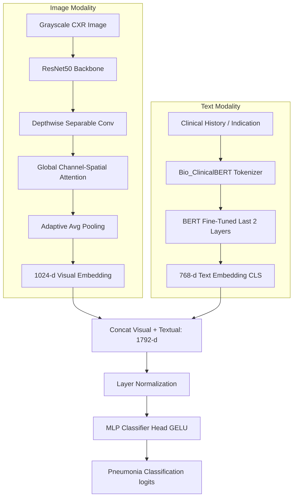

# PneumoFusionNet — Multimodal Pneumonia Classification Pilot Study (`mimic_pilot_139`)

This repository documents the **Pilot Study** phase of **PneumoFusionNet**, a multimodal medical diagnostic network that combines Chest X-rays (CXR) and Clinical Radiology Reports to classify chest radiographs for the presence of **Pneumonia**.

---

## 📁 Repository Directory Structure

```text
mimic_pilot_139/
├── Notebooks/
│   ├── Phase-1mimic_image_classifier.ipynb                 # Phase 1: Image only (Imbalanced baseline)
│   ├── Phase-1.1mimic_image_classifier(balanced-Set).ipynb  # Phase 1.1: Image only (Balanced cohort)
│   ├── Phase-2-FINAL_multimodal_classifier.ipynb            # Phase 2: Multimodal (Imbalanced)
│   └── Phase-2.1-multimodal_classifier(balanced-Set).ipynb  # Phase 2.1: Multimodal (Balanced) ★
├── dataset_139/
│   ├── mimic_dataset.csv                                    # Metadata for Phase 1 & 1.1
│   └── mimic_multimodal_dataset_v3.csv                      # Metadata for Phase 2 & 2.1
├── mimic-cxr-jpg/                                           # Cohort Chest X-ray images (p10 subfolder)
│   └── 2.1.0/
│       └── files/
│           └── p10/
├── reports/
│   └── txt/                                                 # Raw text clinical radiology reports
├── outputs/                                                 # Trained model weights & outputs per phase
│   ├── phase_1/
│   ├── Phase_1.1(balanced set)/
│   ├── phase_2/
│   └── Phase_2.1(balanced set)/
├── requirements.txt                                         # Python library dependencies
├── pilot_experiment_summary.md                              # Complete experiment write-up
└── README.md                                                # This documentation guide
```

---

## ⚙️ Model Architectures

PneumoFusionNet fuses representations from visual and text encoders to perform joint classification:



### 1. Visual Encoder (`PneumoFusionNet`)
* **Backbone:** ResNet50 pretrained on ImageNet, adapted for grayscale single-channel inputs.
* **DSC (Depthwise Separable Convolution):** Reduces parameter overhead while maintaining strong spatial feature extraction.
* **GCSA (Global Channel-Spatial Attention):** Focuses the CNN's attention on both channel-wise features and critical spatial regions (e.g., lung consolidations/infiltrates).
* **Output:** $1024$-dimensional visual embedding.

### 2. Textual Encoder
* **Model:** `emilyalsentzer/Bio_ClinicalBERT` (pre-trained on MIMIC clinical reports).
* **Target Leakage Prevention:** The `IMPRESSION` section is programmatically stripped. The model utilizes only the pre-diagnostic clinical text (`INDICATION` and `FINDINGS` sections) for realistic clinical predictions.
* **Output:** $768$-dimensional textual embedding (taken from the `[CLS]` token).

### 3. Fusion Head
* Concatenates Visual ($1024$-d) and Textual ($768$-d) embeddings into a single $1792$-dimensional vector.
* Processes the fused features via a multi-layer perceptron (MLP) classification head ($1792 \to 512 \to 256 \to 2$) stabilized by Layer Normalization and Dropout.

---

## 📈 Pilot Study Results

All experiments were evaluated on the test split using `SEED=42`:

| Phase | Modality | Dataset | Test AUC | Test Accuracy | Test F1 (Macro) |
| :--- | :--- | :--- | :---: | :---: | :---: |
| **Phase 1** | Image Only | Imbalanced (118:21) | 0.6667 | 0.7619 | 0.4300 |
| **Phase 1.1** | Image Only | **Balanced (21:21)** | **0.9167** | **0.8571** | **0.8571** |
| **Phase 2** | Image + Text | Imbalanced (118:21) | 0.7037 | 0.8095 | 0.4474 |
| **Phase 2.1** | Image + Text | **Balanced (21:21)** | **0.9167** | **0.7143** | **0.7083** |

---

## 📐 Mathematical Proof of Statistical Variance

In the balanced experiments, the pilot cohort consists of **$42$ samples**. Based on the $70/15/15$ split:
* **Train:** 29 samples
* **Val:** 6 samples
* **Test:** **7 samples**

Because the test split contains only $7$ samples:
* **Phase 1.1 Accuracy (85.71%):** $6$ out of $7$ correct predictions.
* **Phase 2.1 Accuracy (71.43%):** $5$ out of $7$ correct predictions.
* **Accuracy Shift:** $\Delta = 1$ sample classification change.

### 1. Binomial Confidence Intervals ($95\%$ Confidence)
The standard error ($SE$) of the sample proportion $p$ is computed as:

$$SE = \sqrt{\frac{p(1-p)}{N}}$$

* **Phase 1.1 CI:** $0.8571 \pm 0.2593 \approx [59.78\%, 100\%]$
* **Phase 2.1 CI:** $0.7143 \pm 0.3346 \approx [37.97\%, 100\%]$

### 2. Fisher's Exact Test Contingency Table

| Success | Phase 1.1 | Phase 2.1 | Row Totals |
|---|---|---|---|
| Correct | 6 | 5 | 11 |
| Incorrect | 1 | 2 | 3 |
| Column Totals | 7 | 7 | 14 |

* **$p$-value $\approx 1.000$**

The statistical overlap and $p$-value demonstrate that the $14.28\%$ accuracy difference is **statistically insignificant** and is a consequence of random noise due to the small test sample size ($N=7$).

---

## 🚀 Road Map: Scale-Up Phase ($1000+$ Samples)

To transition to a robust, publication-grade model, the next phase will implement the following scale-up changes:

1. **Cohort Expansion:** Increase sample size to **$1000+$ samples** (500 Normal, 500 Pneumonia) to reduce evaluation margins of error below $\pm 3\%$.
2. **Standardize Projections:** Filter dataset to Frontal Posteroanterior (**PA-only**) views to eliminate orientation variance (exclude Lateral and AP views).
3. **Data Isolation:** Implement `GroupShuffleSplit` or `StratifiedGroupKFold` grouped by patient ID (`subject_id`) to prevent any patient-level leakage across splits.
4. **Physiological Modality (Phase 3):** Match radiography timestamps with structured MIMIC-IV laboratory reports (White Blood Cell count, C-Reactive Protein, and Procalcitonin) to construct a 3-way multimodal network.

---

## 💻 Setup and Usage

### Prerequisites
Make sure Python 3.8+ is installed. Clone the repository and install the dependencies:
```bash
pip install -r requirements.txt
```

### Path Configuration
Before running the notebooks, verify the paths in Step 2:
```python
BASE_DIR = r'C:\2026\PneumoFusionNet\mimic\mimic_pilot_139'
# Notebook will map image paths dynamically using:
OLD_IMG  = r'C:\2026\PneumoFusionNet\mimic\MIMIC_CXR_JPG_P1\p10'
NEW_IMG  = r'C:\2026\PneumoFusionNet\mimic\mimic_pilot_139\mimic-cxr-jpg\2.1.0\files\p10'
```

### Running the Pipeline
Run the notebooks sequentially:
1. **`Phase-1mimic_image_classifier.ipynb`**: Trains the image-only baseline.
2. **`Phase-1.1mimic_image_classifier(balanced-Set).ipynb`**: Evaluates the image-only baseline on balanced classes.
3. **`Phase-2-FINAL_multimodal_classifier.ipynb`**: Trains the multimodal network (BERT + CNN).
4. **`Phase-2.1-multimodal_classifier(balanced-Set).ipynb`**: Evaluates the multimodal model on balanced classes.
